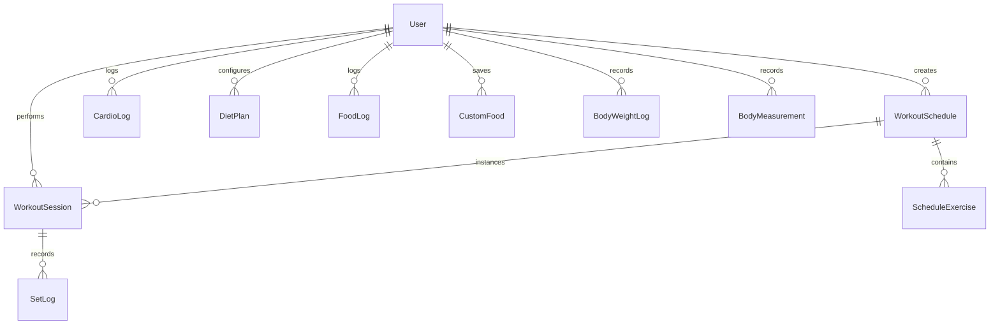

<div align="center">

# ⚡ FORGE

### High-Performance Fitness & Diet Tracking Progressive Web App (PWA)

[](https://nextjs.org/)
[](https://reactjs.org/)
[](https://www.typescriptlang.org/)
[](https://tailwindcss.com/)
[](https://www.prisma.io/)
[](https://neon.tech/)
[](https://vercel.com/)

<p align="center">
  A sleek, dark-themed, mobile-first progressive web application engineered for strength athletes, bodybuilders, and fitness enthusiasts. Built to eliminate workout tracking friction, automate progressive overload detection, snapshot diet macros, and visualize body composition trends.
</p>

</div>

---

## 🌟 Key Features

### 🏋️‍♂️ 1. Training & Progressive Overload Engine

- **Live Active Session Mode**: Real-time workout duration timer, set-by-set weight/rep logger, and notes.
- **Server-Side PR Detection**: Instant 🏆 **Personal Record badges** triggered whenever you beat your all-time historical max weight for any exercise.
- **"Last Time" Progressive Overload Reference**: Displays your exact weight and reps from your previous session directly on each exercise card.
- **In-Session Rest Timer**: Auto-starting circular rest countdown timer with `+30s` / `-30s` adjustments, skip controls, and haptic feedback.
- **Add Exercises On-The-Fly**: Add extra movements to your live session without modifying your baseline template.
- **Custom Split Templates**: Create, edit, and manage multi-day training splits (Push / Pull / Legs / Upper / Lower / Full Body).
- **Conditioning & Cardio**: Dedicated 15-minute cardio countdown timer with automated progress logging.

### 🥗 2. Diet, Nutrition & Macro Snapshotting

- **Hierarchical Food Search**: Instant debounced search querying custom user recipes first, followed by USDA FoodData Central.
- **Immutable Macro Snapshots**: Logs preserve exact nutritional data snapshot at the moment of consumption—even if underlying recipes change later.
- **Remaining Target Calculator**: Live remaining calories, protein, carbs, and fat breakdown (`Target - Consumed`).
- **Daily Adherence Score**: Computes daily nutritional consistency percentage.
- **7-Day Historical Breakdown**: Interactive 7-day day-picker strip allowing you to browse past meals, inspect past adherence, and view weekly averages.
- **Daily Midnight Auto-Renew**: Automatically starts fresh every day at midnight while safely preserving all historical logs.
- **Custom Food Creator**: Easily save home-cooked recipes (e.g. roti blends, custom protein smoothies, homemade meals).

### 📈 3. Body Composition & Progress Analytics

- **Weight Progression Area Chart**: Interactive Recharts gradient area graph tracking weight trends against your target goal weight.
- **Per-Exercise Lift Progression**: Select any exercise from your history to view your strength gains and 1RM progression over time.
- **Weekly Body Tape Measurements**: Log and monitor circumference changes (chest, waist, arms, thighs).

### 📱 4. Dark Theme & Installable PWA

- **Aesthetic Dark Theme**: Engineered with `--bg: #0A0B0E`, radial violet top-glow, and high-contrast performance accents (`Lime: #CBFF4D`, `Violet: #7B6CFF`, `Coral: #FF6E52`).
- **Glassmorphism Navigation**: Floating frosted pill bottom navigation bar.
- **Standalone PWA**: Installable on iOS (Safari) and Android (Chrome) as a native full-screen app with zero address bar distractions.

### 🎯 5. 3-Step Smart Onboarding

- Dynamic user profile setup calculating **TDEE & BMR** using Mifflin-St Jeor formula.
- Custom macro allocation with **2.0g protein / kg bodyweight**.
- Auto-seeds personalized workout schedules based on your gym frequency (3 to 6 days/week).

---

## 🛠️ Tech Stack & Architecture

| Layer              | Technology                                                                         |
| ------------------ | ---------------------------------------------------------------------------------- |
| **Framework**      | [Next.js 14 (App Router)](https://nextjs.org/)                                     |
| **Language**       | [TypeScript 5](https://www.typescriptlang.org/)                                    |
| **Styling**        | [Tailwind CSS](https://tailwindcss.com/) + CSS Variables + Glassmorphism Utilities |
| **Database**       | [Neon Serverless PostgreSQL](https://neon.tech/)                                   |
| **ORM**            | [Prisma ORM 5.22](https://www.prisma.io/)                                          |
| **Authentication** | [NextAuth.js v4](https://next-auth.js.org/) (JWT Strategy)                         |
| **Visualizations** | [Recharts](https://recharts.org/)                                                  |
| **Icons**          | [Lucide React](https://lucide.dev/)                                                |
| **Typography**     | Space Grotesk, Inter, JetBrains Mono                                               |
| **Hosting**        | [Vercel](https://vercel.com/)                                                      |

---

## 🚀 Step-by-Step Local Development Setup

### 1. Prerequisites

- **Node.js 18+ or 20+** (`node -v`)
- **npm** or **yarn** / **pnpm**
- A free PostgreSQL database from [Neon.tech](https://neon.tech) or [Supabase](https://supabase.com)

### 2. Clone the Repository

```bash
git clone https://github.com/<your-username>/fitness-tracker.git
cd fitness-tracker
```

### 3. Install Dependencies

```bash
npm install
```

### 4. Configure Environment Variables

Create a `.env` file in the root directory:

```env
# PostgreSQL connection URL (Neon / Supabase / Local Postgres)
DATABASE_URL="postgresql://<user>:<password>@<host>/<database>?sslmode=require"

# NextAuth Configuration
NEXTAUTH_SECRET="forge-development-secret-key-32chars-minimum"
NEXTAUTH_URL="http://localhost:3000"

# Optional USDA FoodData Central Key (uses built-in fallback dataset if omitted)
USDA_API_KEY="DEMO_KEY"
DEMO_MODE="false"
```

### 5. Push Database Schema

```bash
npx prisma db push
```

### 6. Start the Development Server

```bash
npm run dev
```

Open **`http://localhost:3000`** on your computer, or **`http://<your-local-ip>:3000`** on your mobile phone on the same Wi-Fi network!

---

## 🌐 How to Deploy to Vercel (Production)

Deploying Forge to Vercel takes less than 2 minutes:

### Step 1: Import Project into Vercel

1. Log in to [Vercel](https://vercel.com/) with your GitHub account.
2. Click **"Add New..."** ➔ **"Project"**.
3. Select your **`fitness-tracker`** repository and click **"Import"**.

### Step 2: Configure Environment Variables

In the **Environment Variables** section before clicking deploy, add the following:

| Variable          | Value                           | Description                                                      |
| ----------------- | ------------------------------- | ---------------------------------------------------------------- |
| `DATABASE_URL`    | `postgresql://...`              | Your Neon PostgreSQL connection string (with `?sslmode=require`) |
| `NEXTAUTH_SECRET` | `your-32-char-random-secret`    | Random 32+ character string for token signing                    |
| `NEXTAUTH_URL`    | `https://<your-app>.vercel.app` | Your live Vercel domain                                          |
| `USDA_API_KEY`    | `DEMO_KEY`                      | _(Optional)_ USDA API Key                                        |
| `DEMO_MODE`       | `false`                         | Production mode                                                  |

### Step 3: Deploy

1. Click **"Deploy"**.
2. Vercel will automatically run `prisma generate && next build`.
3. Your live production URL will be ready at `https://<your-app>.vercel.app`!

> [!TIP] > **Automatic CI/CD**: Every time you push new code to your `main` branch (`git push origin main`), Vercel will automatically build and deploy the update with zero downtime.

---

## 📲 Installing Forge as a Mobile PWA

### iOS (iPhone Safari)

1. Open your live app URL in **Safari**.
2. Tap the **Share** button (box with an arrow pointing up).
3. Scroll down and tap **"Add to Home Screen"**.
4. Tap **"Add"** in the top-right corner.

### Android (Google Chrome)

1. Open your live app URL in **Chrome**.
2. Tap the **three dots menu (⋮)** in the top-right corner.
3. Tap **"Install app"** or **"Add to Home screen"**.
4. Confirm by tapping **"Install"**.

---

## 🗄️ Database Schema Diagram



---

## 📄 License

This project is open-source and available under the [MIT License](LICENSE).
